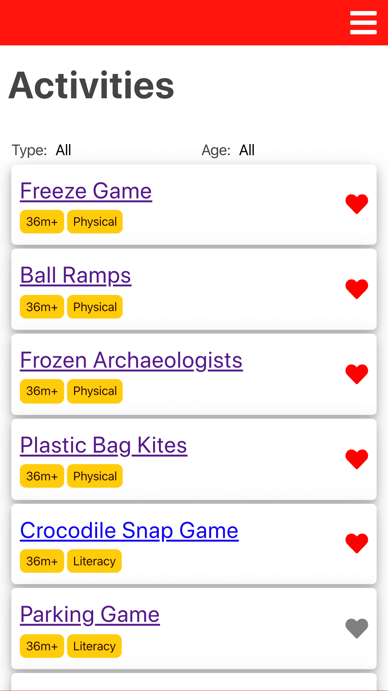
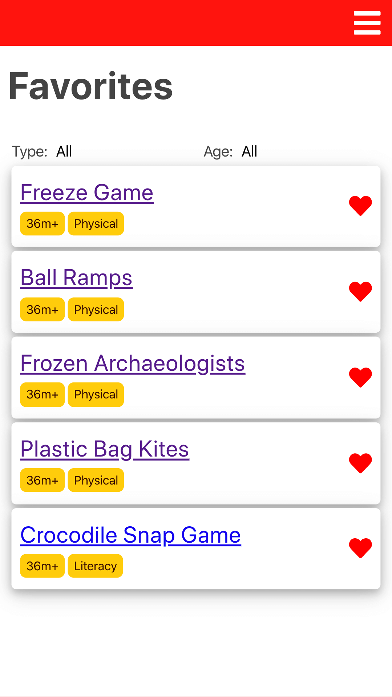
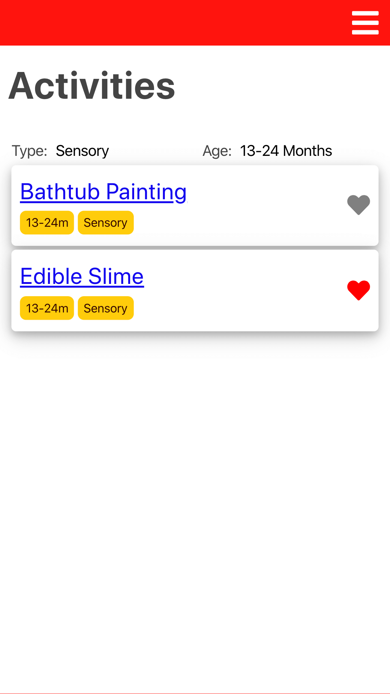

# Babytivities Client:

Babytivities allows users to view, filter, & favorite activites that parents can do with their children from home.

## Live Page: [Babytivities](https://babytivities-app.now.sh/)

## Server: [Babytivities server GitHub](https://github.com/codylee02/babytivities-api)

## Technology Used

- React
- HTML
- JS
- CSS

## Screenshots:

